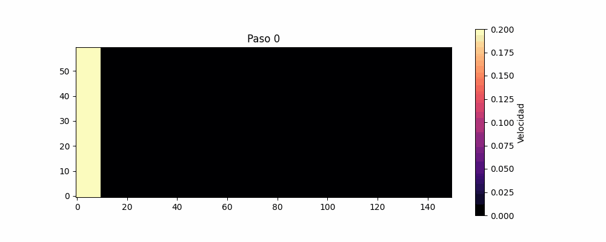

# Simulación de Fluidos 2D con el Método de Lattice Boltzmann

Este proyecto implementa una simulación bidimensional de flujo de fluidos utilizando el método de Lattice Boltzmann (LBM). La simulación incluye obstáculos en el dominio y permite generar visualizaciones en forma de imágenes y animaciones GIF.

---

## Estructura del Proyecto

├── algoritmo.py # Funciones principales del LBM (colisión, propagación, etc.)

├── gif.py # Función para crear un GIF a partir de imágenes

├── guardarimg.py # Guarda imágenes de cada frame de la simulación

├── main.py # Script principal de simulación

├── obstaculo.py # Generador de obstáculos (e.g., triángulo)

├── parametros.py # Parámetros de simulación

├── imagenes_lbm/ # Carpeta donde se guardan las imágenes generadas

├── README.md # Este archivo

## Cómo Ejecutar

1. **Clona o descarga** este repositorio.

2. Asegúrate de tener Python 3 instalado, junto con los siguientes paquetes:

```bash
pip install numpy matplotlib imageio
```

3. Ejecutar el archivo main

```bash
python3 main.py
```
# Parametros

Nx             # Número de nodos en x

Ny             # Número de nodos en y

u0             # Velocidad inicial

viscosidad     # Viscosidad cinemática

paso_de_tiempo # Total de pasos temporales

guardar_cada   # Intervalo de guardado de imágenes

## Resultados

# Ejemplo de un circulo



# Aeorodinamica de una vaca


